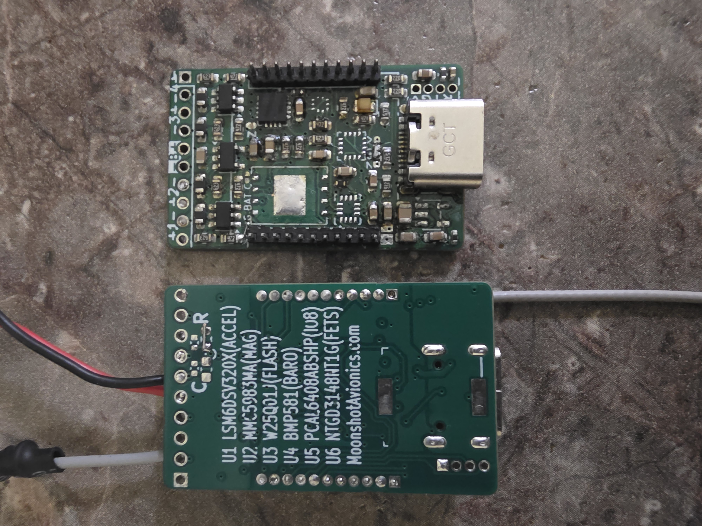

# Moonshot Avionics

Telemetry, GPS tracking and parachute recovery for model rockets, over LoRa.

**[Open the control page →](https://bucketshoes.github.io/MoonshotAvionics/)**

The control page is a browser dashboard that talks to the flight computer either
over Bluetooth Low Energy (BLE) directly, or over a LoRa link via a base station.
It shows live telemetry, plots the flight, downloads flash logs, and sends
authenticated commands (arm, disarm, ground test fire, radio config, firmware
update).

---

## Moonshot V1

Flying hardware. The firmware in this repo is written for it.

- Custom firmware for the flight computer, base station and dashboard — all in this repo.
- Based on the **Heltec Wireless Tracker V1.1** (ESP32-S3 + SX1262 LoRa + GNSS).
- Sensors from a **DFRobot SEN0140 v2** 10-DOF board: ADXL345 accelerometer, ITG3200 gyro,
  VCM5883L magnetometer, BMP280 barometer.
- Base station runs on Heltec WiFi LoRa 32 V4.x / Wireless Tracker boards.
- Control page: **https://bucketshoes.github.io/MoonshotAvionics/**

## Moonshot V2

Flying hardware. Custom PCB. Its firmware is not published here yet, and the
control page link is coming soon.
Ultra small. 18mm X 26mm, fits in 24mm min diameter

- Custom carrier PCB — the lower board in the photo; the Heltec module sits above it.
- **3 pyro channels** plus **1 auxiliary high-current channel**.
- **8 kHz logging** to onboard flash.
- Parts, as silkscreened on the board:
  - U1 `LSM6DSV320X` — 8khz 320g high-g & 16g low g accelerometer & gyro / IMU
  - U2 `MMC5983MA` — magnetometer
  - U3 `W25Q01JV` 1GBit NOR /`W25N02` 2Gbit NAND for high rate
  - U4 `BMP581` — barometer
  - U5 `PCAL6408ABSHP` — I/O expander
  - U6 `NTGD3148NT1G` — pyro FETs
- Coming soon: air-start and dual-deploy software, and fin-flutter/resonance FFT
  (Fast Fourier Transform) analysis of the high-rate log data.

### V2 PCB documents

Kicad files coming soon.

Board plots exported as PDFs (no CAD source files are checked into this repo):

- [pcb.pdf](docs/pcb.pdf)
- [pcb-color.pdf](docs/pcb-color.pdf)
- [Moonshot B35.pdf](<docs/Moonshot B35.pdf>)

## Moonshot V3

In development. Target 29mm+. Two processors, split by job.

- **STM32H7** — tight real-time code: sensor fusion and active aerodynamic
  control to keep the rocket inside its bounds. Servo fins / TVC (thrust vector
  control), with an airbrake planned.
- **ESP32-C6** — logging, commands, camera, microphone, and the radio link
  (LoRa, BLE, and 802.15.4). It snoops the sensor buses so it can log the full
  sensor data without getting in the H7's way.
- Same IMU as V2 (`LSM6DSV320X`), with an upgraded magnetometer and barometer.
- More pyro channels than V2.

## Base station: any Lora flight computer, or depopulated sensors/flash for cheaper.
---

## Repository layout

| Path | Contents |
|---|---|
| `rocket_avionics/` | Flight computer firmware (ESP32-S3) |
| `base_station/` | Base station firmware |
| `common/` | Shared headers: board pinouts, radio config, log format |
| `docs/` | The control page (published by GitHub Pages) and PCB PDFs |
| `design documents/` | Protocol, flight phase, log format and dashboard specs |
| `boards/` | PlatformIO board definitions |

Firmware builds with [PlatformIO](https://platformio.org/); see `platformio.ini`
for the per-board environments.

## Safety

This project fires pyrotechnic ejection charges. Arming is required before any
automatic pyro action, and ground test firing is command-only. Treat it
accordingly, and follow your local rocketry safety code. All traffic is unencrypted, but commands are cryptographically signed to avoid accidental actions.

This project is just my work, and for me to use the control page (needs https hosted for BLE). it's public so others can look, but it's really not recommended anyone else uses it. it's buggy and poorly tested. If you want to use it, test it for yourself for your use case, don't blame me if you blow yourself up, or land your model rocket on someone's head. you really shouldn't be using random code on the internet. no guarantees.
